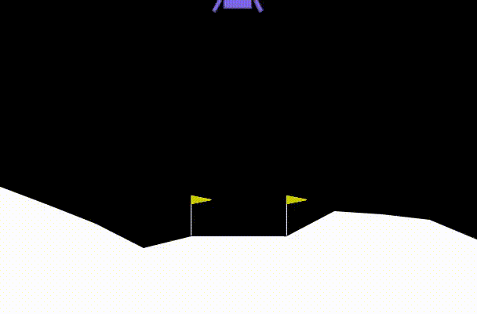

# LUNAR-LANDER
*Implement Lunar-lander problem using DQN...*

#### **Sparse vs. Shaped Reward Functions:**
In reinforcement learning, the reward function defines how the agent receives feedback from its environment. A sparse reward provides feedback only when specific goals or milestones are achieved, such as reaching a target state, making learning more challenging but encouraging long-term planning. In contrast, a shaped reward offers more frequent feedback by assigning intermediate rewards for partial progress toward the goal. This helps guide the agent’s behavior and accelerates learning but can sometimes bias the agent toward suboptimal strategies if not carefully designed.

#### Reference - [**Reward Function in RL!**](https://youtu.be/IdJL9rcQrFU?si=iNVziAoSXl0Dehbw)
